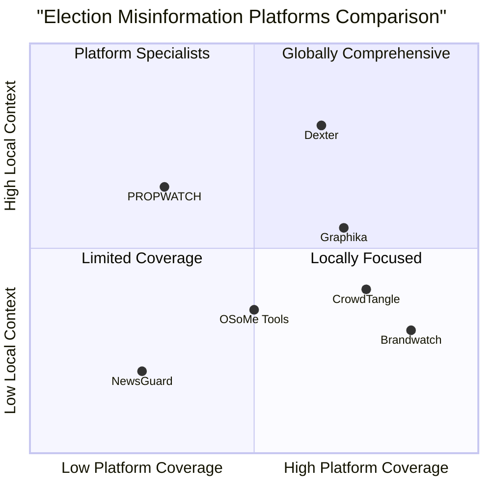

# Product Requirements Document (PRD): Dexter

## Election Misinformation Detection and Tracking Platform

**Date:** May 12, 2025  
**Project Name:** dexter_platform  
**Original Requirements:** End-to-end platform Web based and fully optimized for mobile screens with a responsive dashboard for Researchers / election observers to detect and track election misinformation

---

## 1. Product Definition

### 1.1 Product Goals

1. **Comprehensive Detection:** Create a scalable AI-driven system that effectively detects, tracks, and analyzes election-related misinformation and coordinated inauthentic behavior across multiple platforms, languages, and media types.

2. **Actionable Intelligence:** Provide civil society organizations, journalists, fact-checkers, and election observers with real-time, actionable insights that enable timely intervention against election misinformation.

3. **Ethical Transparency:** Establish a trustworthy system that adheres to ethical AI principles, incorporates diverse perspectives, and maintains transparent operations while safeguarding democratic processes.

### 1.2 User Stories

1. **As a** civil society organization monitoring election integrity, **I want** to track emerging misinformation narratives across social media platforms **so that** I can develop targeted counter-messaging campaigns before false information becomes widespread.

2. **As a** journalist investigating election misinformation, **I want** to identify key spreaders and coordinated networks **so that** I can report accurately on who is behind manipulation campaigns and verify their authenticity.

3. **As an** election observer deployed to a specific region, **I want** to receive real-time alerts about local misinformation trends **so that** I can adjust monitoring efforts and verify on-the-ground conditions.

4. **As a** research analyst, **I want** to visualize how misinformation narratives evolve over time and across platforms **so that** I can identify critical intervention points and patterns of manipulation.

5. **As a** local fact-checking organization, **I want** to access Nigeria-specific lexicons and cultural context **so that** I can accurately identify coded messaging and localized misinformation narratives.

### 1.3 Competitive Analysis

| Platform | Pros | Cons |
|----------|------|------|
| **CrowdTangle** | - Extensive social media monitoring - Strong visualization tools - Data export capabilities | - Limited AI analysis - Not election-focused - No coordinated behavior detection - Limited access after Meta acquisition |
| **Brandwatch** | - Multi-platform monitoring - Advanced analytics - Customizable dashboards | - High cost - Generic focus - Limited local language support - Complex for non-technical users |
| **NewsGuard** | - Expert credibility ratings - Transparent methodology - Browser integration | - Limited to news sites - Doesn't track narratives - No social media monitoring - Western-centric approach |
| **OSoMe Tools** | - Free academic tools - Bot detection capability - Network analysis | - Fragmented tools - Limited languages - Technical complexity - No real-time alerting |
| **Graphika** | - Advanced network analysis - Visual mapping - Influence operations focus | - Primarily enterprise - Limited self-service - Requires analyst expertise - Not optimized for local contexts |
| **PROPWATCH** | - Electoral focus - Monitoring propaganda - Regional expertise | - Limited platform coverage - Less advanced AI - Smaller scale operation - Limited visualization tools |
| **Dexter** | - Election-specific focus - Local language/context integration - Real-time intervention tools - Ethical AI framework - Multi-platform monitoring | - New entrant - Initially focused on Nigeria - Developing user base - Evolving model accuracy |

### 1.4 Competitive Quadrant Chart

---

## 2. Technical Specifications

### 2.1 Requirements Analysis

The Dexter platform requires an architecture that can handle diverse data streams while maintaining scalability, reliability, and security. Key technical considerations include:

#### 2.1.1 Data Sources and Types
- **Social Media Platforms:** Twitter/X, Facebook, TikTok, YouTube, Telegram, and WhatsApp (where available)
- **Media Types:** Text, images, videos, audio clips, memes, sticker packs
- **Languages:** English, Pidgin, Hausa, Yoruba, and Igbo

#### 2.1.2 Core Capabilities
- **Narrative Detection:** Identify and classify misinformation themes using NLP techniques
- **Actor Analysis:** Map networks and key spreaders using graph theory and machine learning
- **Timeline Tracking:** Monitor narrative evolution over time with temporal analysis
- **Trend Analysis:** Detect volume, tone, and geographic changes to provide early warnings

#### 2.1.3 User Interface Requirements
- **Responsive Design:** Full functionality across desktop and mobile devices
- **Role-based Access:** Tailored views for different user types (researchers, journalists, observers)
- **Interactive Visualizations:** Intuitive charts, maps, and network graphs
- **Alert System:** Configurable notifications based on user preferences

#### 2.1.4 Non-functional Requirements
- **Performance:** Handle large data volumes with minimal latency
- **Security:** Protect sensitive data and user privacy
- **Scalability:** Accommodate increased usage during election periods
- **Reliability:** Maintain uptime during critical election events
- **Accessibility:** Comply with WCAG standards for all users

### 2.2 Requirements Pool

#### P0 (Must-have)

1. **Multi-platform Data Collection**
   - Establish API connections to major social media platforms
   - Create a unified data schema for cross-platform analysis
   - Implement rate limiting and caching to handle API restrictions

2. **Narrative Mapping and Lexicon Development**
   - Build Nigeria-specific lexicons for key languages
   - Develop classification models to identify misinformation themes
   - Create a tagging system for manual verification and feedback

3. **Actor and Network Analysis**
   - Implement graph analysis algorithms to identify influential spreaders
   - Detect coordinated inauthentic behavior patterns
   - Create actor profiles with activity history and influence metrics

4. **Timeline and Trend Visualization**
   - Display narrative evolution over customizable time ranges
   - Create interactive charts showing volume, tone, and geographic distribution
   - Implement filtering by narrative, actor, and platform

5. **Responsive Web Interface**
   - Develop mobile-optimized dashboard for field usage
   - Create role-based access control system
   - Implement secure authentication and session management

#### P1 (Should-have)

6. **Alerting System**
   - Create customizable alert criteria (e.g., volume spikes, new actors)
   - Implement multiple notification channels (in-app, email, SMS)
   - Develop an alert management interface with status tracking

7. **Report Generation**
   - Design templates for common report types
   - Enable custom report building with selectable metrics
   - Create export options (PDF, CSV, shareable links)

8. **Collaborative Features**
   - Implement shared workspaces for teams
   - Create annotation and tagging capabilities
   - Develop a system for delegating tasks and alerts

9. **Ethical AI Framework**
   - Implement fairness metrics and bias detection
   - Create transparency logs for model decisions
   - Design community review processes for questionable content

10. **Offline Functionality**
    - Enable basic dashboard viewing without internet connection
    - Create data synchronization for intermittent connectivity
    - Implement local storage for critical information

#### P2 (Nice-to-have)

11. **Advanced Media Analysis**
    - Implement image recognition for meme detection
    - Develop audio transcription and analysis
    - Create video content analysis capabilities

12. **Predictive Analytics**
    - Forecast potential misinformation trends
    - Predict high-risk periods based on historical patterns
    - Identify potential targets before campaigns begin

13. **Integration with Fact-Checking Tools**
    - Create APIs for fact-checking organizations
    - Implement a verification status tracking system
    - Develop plugins for common publishing platforms

14. **User Feedback Loop**
    - Create a mechanism for reporting false positives/negatives
    - Implement model retraining based on user feedback
    - Develop user satisfaction metrics

15. **Geographic Expansion**
    - Create templates for adapting to new countries/regions
    - Design language addition frameworks
    - Develop partnership models for local expertise

### 2.3 UI Design Draft

#### 2.3.1 Landing Page

The landing page will serve as the entry point for new and returning users, featuring:

- **Hero Section:** Bold headline stating Dexter's mission with a clear call-to-action
- **Features Overview:** Cards highlighting key capabilities with supporting visuals
- **How It Works:** Step-by-step explanation of the platform's workflow
- **Testimonials:** Quotes from partners to build credibility
- **About Section:** Brief history and mission statement
- **FAQ Section:** Addressing common questions about the platform

#### 2.3.2 Dashboard Home

The home dashboard will provide an overview of system activity:

- **Navigation:** Sidebar menu with clear icons and labels
- **Quick Stats:** Key metrics in card format (active narratives, flagged actors)
- **Recent Activity:** Timeline of latest events and updates
- **Quick Links:** User-specific shortcuts to frequent actions
- **Alerts Panel:** Highlighted notifications requiring attention

#### 2.3.3 Narratives Section

This section will allow users to explore misinformation themes:

- **List View:** Sortable table of narratives with key metrics
- **Detail View:** In-depth analysis of selected narrative
- **Associated Content:** Examples of posts spreading the narrative
- **Visualization:** Charts showing spread patterns and impact
- **Actions:** Tools to flag, annotate, or export findings

#### 2.3.4 Actors Section

This section will focus on individuals and networks spreading misinformation:

- **Grid View:** Cards showing key actors with influence scores
- **Network Graph:** Interactive visualization of connections
- **Timeline:** Actor's activity history and narrative associations
- **Profile Details:** In-depth information about behavior patterns
- **Watchlist Management:** Tools to monitor specific actors

#### 2.3.5 Mobile Optimization

The mobile interface will maintain core functionality while adapting to smaller screens:

- **Collapsible Navigation:** Menu that expands/contracts as needed
- **Simplified Charts:** Optimized visualizations for touch interaction
- **Priority Information:** Focus on critical alerts and findings
- **Offline Cache:** Storage of recent data for field use
- **Touch-Friendly Controls:** Larger tap targets and swipe navigation

### 2.4 Open Questions

1. **Data Access:** How will Dexter maintain API access to platforms with increasingly restrictive policies?

2. **Verification Process:** What specific methodology will be used to verify the accuracy of AI-detected misinformation?

3. **Response Protocol:** What is the escalation path when potentially harmful misinformation is detected?

4. **Performance Metrics:** How will we measure the platform's effectiveness in combating election misinformation?

5. **Ethical Boundaries:** What criteria determine when the platform should or should not intervene in detected misinformation?

6. **Stakeholder Engagement:** How will we ensure ongoing input from Nigerian civil society to maintain local relevance?

7. **Language Evolution:** How will the system adapt to rapidly changing slang and coded language?

8. **Sustainability Model:** What is the long-term funding and maintenance strategy beyond the initial deployment?

---

## 3. Implementation Strategy

### 3.1 Development Phases

#### Phase 1: Foundation (Months 1-2)
- Establish data collection infrastructure
- Build initial database schema
- Create baseline narrative corpus
- Develop authentication system
- Implement basic UI framework

#### Phase 2: Core Features (Months 3-4)
- Develop narrative detection algorithms
- Build actor analysis capabilities
- Create timeline visualization tools
- Implement alert mechanism
- Develop mobile-responsive UI

#### Phase 3: Testing & Refinement (Months 5-6)
- Conduct user testing with Nigerian partners
- Refine models based on feedback
- Optimize performance and security
- Implement ethical review process
- Develop documentation and guides

#### Phase 4: Launch & Iteration (Months 7-8)
- Deploy MVP to selected partners
- Monitor system performance
- Gather usage metrics and feedback
- Implement priority improvements
- Begin planning for expansion

### 3.2 Technical Architecture

#### Frontend
- React.js for component-based UI
- Tailwind CSS for responsive design
- D3.js and Vis.js for interactive visualizations
- Progressive Web App (PWA) capabilities for offline functionality

#### Backend
- Node.js/Express for API services
- Python for data processing and ML pipelines
- PostgreSQL for relational data
- MongoDB for unstructured content storage
- Redis for caching and real-time features

#### AI Components
- Transformer-based models for text analysis
- Graph Neural Networks for network analysis
- Computer vision models for image processing
- Anomaly detection for identifying coordinated behavior

#### Infrastructure
- Containerized microservices (Docker/Kubernetes)
- Cloud-based deployment with regional instances
- CI/CD pipeline for continuous improvement
- Robust backup and disaster recovery

### 3.3 Team Structure

- **Product Manager:** Overall vision and requirements
- **UX/UI Designers:** User experience and interface design
- **Frontend Engineers:** Dashboard and visualization development
- **Backend Engineers:** API and data processing systems
- **Data Scientists:** ML model development and optimization
- **QA Engineers:** Testing and quality assurance
- **Security Specialist:** Ensuring data protection and compliance
- **Nigerian Partners:** Local expertise and validation

### 3.4 Success Metrics

- **User Adoption:** Number of active organizations and users
- **Detection Accuracy:** Precision and recall of misinformation identification
- **Response Time:** Time from detection to user notification
- **User Satisfaction:** Feedback scores and feature utilization
- **Impact Measurement:** Documented cases of successful interventions
- **System Performance:** Uptime, latency, and error rates

---

## 4. Future Roadmap

### 4.1 Post-MVP Features

- **Advanced Media Analysis:** Enhanced processing of images, video, and audio
- **Additional Language Support:** Expansion to more Nigerian languages
- **API Ecosystem:** Public APIs for integration with other tools
- **Predictive Capabilities:** Forecasting potential misinformation events
- **Mobile Applications:** Dedicated apps for iOS and Android
- **Machine Learning Improvements:** Continuous model training and refinement

### 4.2 Geographical Expansion

- **West Africa:** Adapting to neighboring countries with similar contexts
- **Pan-African:** Scaling to major election events across the continent
- **Global Template:** Creating a framework for worldwide deployment

### 4.3 Research Collaboration

- **Academic Partnerships:** Working with universities to advance detection methods
- **Published Research:** Contributing to the field of election integrity
- **Open Standards:** Developing shared approaches to misinformation classification

---

## 5. Conclusion

Dexter represents a crucial tool in the fight against election misinformation in Nigeria and beyond. By combining advanced AI techniques with deep local context and ethical considerations, the platform aims to empower those defending democratic processes. The responsive, mobile-optimized interface ensures that researchers and observers can access critical insights wherever they are, while the comprehensive analytics provide the depth needed for thorough investigation.

With a phased implementation approach and clear success metrics, Dexter will evolve to meet the changing landscape of misinformation while maintaining its core mission of supporting election integrity through technology-enabled transparency.
