# Dexter System Design

## Implementation approach

After analyzing the requirements for the Dexter platform, I've identified several challenging aspects that require careful architectural consideration:

1. **Multi-platform data collection and analysis**: Dexter must ingest and analyze content from diverse social media platforms (Twitter/X, Facebook, YouTube, TikTok, Telegram, WhatsApp) with varying APIs, rate limits, and data structures.

2. **Multi-lingual processing**: The system must effectively process content in English, Pidgin, Hausa, Yoruba, and Igbo, requiring specialized NLP capabilities.

3. **Scalable real-time analysis**: During election periods, data volume will increase significantly, requiring on-demand scaling while maintaining performance.

4. **Multiple media types**: Processing text, images, videos, and audio requires different analysis pipelines while maintaining a unified classification framework.

5. **Mobile and offline functionality**: Field researchers need reliable access to the platform even with intermittent connectivity.

6. **Ethical AI constraints**: The platform must incorporate fairness and bias detection while providing transparency in AI decision-making.

To address these challenges, I recommend implementing a microservices architecture with the following key frameworks and technologies:

### Frontend
- **React.js** with **TypeScript** for type safety and improved maintainability
- **Tailwind CSS** for responsive design and mobile optimization
- **D3.js** and **Vis.js** for interactive data visualizations 
- **Workbox** for Progressive Web App (PWA) capabilities and offline functionality
- **React Query** for efficient data fetching, caching, and state management

### Backend & APIs
- **Node.js/Express** for RESTful API services and real-time websockets
- **FastAPI** (Python) for machine learning model serving and high-performance API endpoints
- **RabbitMQ** for asynchronous message queuing between services
- **Redis** for caching, session management, and real-time features

### Data Storage
- **PostgreSQL** for structured relational data (users, narratives, verified content)
- **MongoDB** for unstructured content and flexible schema needs
- **Elasticsearch** for powerful text search and analytics capabilities
- **MinIO** (S3-compatible) for media storage (images, videos, audio)

### AI & Machine Learning
- **Hugging Face Transformers** for multilingual NLP tasks
- **PyTorch** for custom ML model development
- **NetworkX** and **DGL** for graph analysis and network visualization
- **scikit-learn** for traditional ML algorithms and feature engineering
- **FastText** for efficient multilingual text classification
- **YOLOv8** for image and video object detection

### DevOps & Infrastructure
- **Docker** and **Kubernetes** for containerization and orchestration
- **GitHub Actions** for CI/CD pipelines
- **Prometheus** and **Grafana** for monitoring and alerting
- **ELK Stack** for centralized logging and analysis

This technology stack provides a robust foundation for building the Dexter platform with the scalability, reliability, and performance required for real-time election misinformation detection and analysis.

## Data structures and interfaces

The following class diagram outlines the core data structures and their relationships within the Dexter system:

```mermaid
classDiagram
    class User {
        +UUID id
        +String name
        +String email
        +String organization
        +UserRole role
        +String[] regions
        +boolean isActive
        +DateTime lastLogin
        +__init__(name, email, organization, role)
        +updateProfile(profile_data)
        +getActivityLog()
    }
    
    class UserRole {
        <<enumeration>>
        ADMIN
        RESEARCHER
        OBSERVER
        ANALYST
        VIEWER
    }
    
    class Alert {
        +UUID id
        +String title
        +String description
        +AlertType type
        +AlertSeverity severity
        +DateTime timestamp
        +UUID[] narrativeIds
        +UUID[] actorIds
        +UUID createdBy
        +boolean isAcknowledged
        +__init__(title, description, type, severity)
        +acknowledge()
        +escalate()
        +assignTo(userId)
    }
    
    class AlertType {
        <<enumeration>>
        VOLUME_SPIKE
        NEW_NARRATIVE
        NEW_INFLUENCER
        COORDINATED_ACTIVITY
        GEOGRAPHIC_SHIFT
    }
    
    class AlertSeverity {
        <<enumeration>>
        LOW
        MEDIUM
        HIGH
        CRITICAL
    }
    
    class Narrative {
        +UUID id
        +String title
        +String description
        +String[] keywords
        +String[] hashtags
        +NarrativeCategory category
        +float confidence
        +DateTime firstDetected
        +DateTime lastUpdated
        +int contentCount
        +String[] languages
        +UUID[] relatedNarrativeIds
        +__init__(title, description, category)
        +addKeywords(keywords)
        +addHashtags(hashtags)
        +updateConfidence(confidence)
        +getRelatedContent()
        +getSpreadMetrics()
    }
    
    class NarrativeCategory {
        <<enumeration>>
        VOTE_RIGGING
        ETHNIC_PROFILING
        CANDIDATE_IMPERSONATION
        VOTER_INTIMIDATION
        PROCEDURAL_MISINFORMATION
        FOREIGN_INTERFERENCE
    }
    
    class Content {
        +UUID id
        +String text
        +String[] mediaUrls
        +ContentType type
        +Platform platform
        +String originalId
        +String url
        +DateTime publishedAt
        +Actor author
        +Location location
        +String language
        +float[] sentimentScores
        +UUID[] narrativeIds
        +String[] detectedEntities
        +VerificationStatus verificationStatus
        +__init__(text, type, platform, originalId)
        +extractEntities()
        +analyzeText()
        +classifyNarrative()
        +verify()
    }
    
    class ContentType {
        <<enumeration>>
        TEXT
        IMAGE
        VIDEO
        AUDIO
        MEME
        STICKER
    }
    
    class Platform {
        <<enumeration>>
        TWITTER_X
        FACEBOOK
        YOUTUBE
        TIKTOK
        TELEGRAM
        WHATSAPP
        INSTAGRAM
        OTHER
    }
    
    class VerificationStatus {
        <<enumeration>>
        UNVERIFIED
        CONFIRMED_TRUE
        CONFIRMED_FALSE
        PARTIALLY_FALSE
        MISLEADING
        SATIRE
        UNDER_REVIEW
    }
    
    class Actor {
        +UUID id
        +String name
        +String platformId
        +Platform platform
        +int followerCount
        +String profileUrl
        +String[] previousNames
        +DateTime accountCreated
        +ActorType type
        +float influenceScore
        +bool isVerified
        +bool onWatchlist
        +__init__(name, platformId, platform)
        +updateInfluenceScore()
        +getActivityHistory()
        +getConnectionNetwork(depth)
        +addToWatchlist(reason)
    }
    
    class ActorType {
        <<enumeration>>
        INDIVIDUAL
        ORGANIZATION
        BOT
        TROLL
        COORDINATED_GROUP
        UNKNOWN
    }
    
    class Network {
        +UUID id
        +String name
        +String description
        +UUID[] actorIds
        +NetworkType type
        +DateTime created
        +DateTime lastUpdated
        +float cohesionScore
        +float coordinationScore
        +__init__(name, description, type)
        +addActors(actorIds)
        +analyzeConnections()
        +detectCoordination()
        +exportGraphData()
    }
    
    class NetworkType {
        <<enumeration>>
        ORGANIC
        COORDINATED
        MIXED
        UNKNOWN
    }
    
    class Location {
        +UUID id
        +String name
        +String country
        +String region
        +String city
        +float latitude
        +float longitude
        +LocationType type
        +__init__(name, country, region, city)
        +getGeocode()
    }
    
    class LocationType {
        <<enumeration>>
        EXACT
        APPROXIMATE
        REGION_LEVEL
        COUNTRY_LEVEL
        UNKNOWN
    }
    
    class Lexicon {
        +UUID id
        +String name
        +String description
        +String language
        +LexiconType type
        +String[] terms
        +String[] patterns
        +DateTime created
        +DateTime lastUpdated
        +__init__(name, description, language, type)
        +addTerms(terms)
        +addPatterns(patterns)
        +matchText(text)
        +exportLexicon()
    }
    
    class LexiconType {
        <<enumeration>>
        HASHTAGS
        KEYWORDS
        SLANG
        DOG_WHISTLES
        MEMES
    }
    
    class Report {
        +UUID id
        +String title
        +String description
        +ReportType type
        +UUID createdBy
        +DateTime createdAt
        +DateTime period_start
        +DateTime period_end
        +UUID[] narrativeIds
        +UUID[] actorIds
        +UUID[] locationIds
        +Map~String, Object~ parameters
        +String[] exportFormats
        +__init__(title, description, type, createdBy)
        +generate()
        +export(format)
        +schedule(frequency, recipients)
    }
    
    class ReportType {
        <<enumeration>>
        DAILY_SUMMARY
        TREND_ANALYSIS
        ACTOR_NETWORK
        NARRATIVE_DEEP_DIVE
        GEOGRAPHIC_SPREAD
        CUSTOM
    }
    
    class DataCollector {
        +UUID id
        +String name
        +Platform platform
        +Map~String, String~ credentials
        +DateTime lastCollection
        +CollectorStatus status
        +int rateLimit
        +int rateLimitRemaining
        +__init__(name, platform, credentials)
        +collectData(parameters)
        +validateCredentials()
        +updateRateLimit(limit, remaining)
        +handleErrors(error)
    }
    
    class CollectorStatus {
        <<enumeration>>
        ACTIVE
        RATE_LIMITED
        ERROR
        PAUSED
        DISABLED
    }
    
    class MLModel {
        +UUID id
        +String name
        +String description
        +ModelType type
        +String version
        +String[] languages
        +float accuracy
        +float precision
        +float recall
        +DateTime trained
        +Map~String, Object~ parameters
        +__init__(name, description, type)
        +predict(data)
        +evaluate()
        +retrain(dataset)
        +exportModel(format)
    }
    
    class ModelType {
        <<enumeration>>
        NARRATIVE_CLASSIFIER
        NETWORK_ANALYZER
        ENTITY_EXTRACTOR
        SENTIMENT_ANALYZER
        MEDIA_CLASSIFIER
        COORDINATION_DETECTOR
    }
    
    class Dashboard {
        +UUID id
        +String name
        +UUID ownerId
        +DashboardType type
        +Widget[] widgets
        +Map~String, Object~ settings
        +String[] sharedWith
        +__init__(name, ownerId, type)
        +addWidget(widget)
        +removeWidget(widgetId)
        +updateLayout(layout)
        +share(userIds)
    }
    
    class DashboardType {
        <<enumeration>>
        OVERVIEW
        NARRATIVE_FOCUSED
        ACTOR_NETWORK
        GEOGRAPHIC
        CUSTOM
    }
    
    class Widget {
        +UUID id
        +String title
        +WidgetType type
        +Map~String, Object~ config
        +int width
        +int height
        +int posX
        +int posY
        +String dataSource
        +Map~String, Object~ filters
        +__init__(title, type, config)
        +updateConfig(config)
        +fetchData()
        +render()
    }
    
    class WidgetType {
        <<enumeration>>
        LINE_CHART
        BAR_CHART
        PIE_CHART
        NETWORK_GRAPH
        MAP
        TABLE
        METRIC
        FEED
        ALERT_LIST
    }
    
    class APIClient {
        +String apiKey
        +String baseUrl
        +DateTime lastRequest
        +int requestCount
        +Map~String, String~ headers
        +__init__(apiKey, baseUrl)
        +get(endpoint, parameters)
        +post(endpoint, data)
        +put(endpoint, data)
        +delete(endpoint, parameters)
        +handleRateLimit()
    }
    
    class AnalyticsService {
        <<service>>
        +analyzeNarrativeTrends(narrativeIds, timeframe)
        +detectAnomalies(dataset, parameters)
        +calculateActorInfluence(actorId)
        +identifyCoordinatedBehavior(actorIds)
        +generateNetworkGraph(parameters)
    }
    
    class NotificationService {
        <<service>>
        +createAlert(alertData)
        +sendNotification(userId, message, channel)
        +notifyGroup(userIds, message)
        +scheduleNotification(message, timestamp, recipients)
        +retrieveNotificationHistory(userId)
    }
    
    class AuthService {
        <<service>>
        +authenticateUser(email, password)
        +generateToken(userId)
        +validateToken(token)
        +resetPassword(email)
        +checkPermissions(userId, resource, action)
    }

    User "1" --> "*" Alert: receives
    User "*" --> "*" Dashboard: owns/views
    User --> UserRole: has
    Alert --> AlertType: has
    Alert --> AlertSeverity: has
    Alert "*" --> "*" Narrative: references
    Alert "*" --> "*" Actor: references
    Narrative --> NarrativeCategory: has
    Narrative "1" --> "*" Content: contains
    Content --> ContentType: has
    Content --> Platform: from
    Content --> VerificationStatus: has
    Content "*" --> "1" Actor: authored by
    Content --> Location: has
    Actor --> ActorType: has
    Actor --> Platform: on
    Actor "*" --> "*" Network: belongs to
    Network --> NetworkType: has
    Network "1" --> "*" Actor: contains
    Lexicon --> LexiconType: has
    Report "*" --> "*" Narrative: includes
    Report "*" --> "*" Actor: includes
    Report "*" --> "*" Location: includes
    Report --> ReportType: has
    Report --> User: created by
    DataCollector --> Platform: collects from
    DataCollector --> CollectorStatus: has
    MLModel --> ModelType: has
    Dashboard --> DashboardType: has
    Dashboard "1" --> "*" Widget: contains
    Widget --> WidgetType: has
```

## Program call flow

The following sequence diagram outlines the main program flows for key Dexter functionality:

```mermaid
sequenceDiagram
    participant Client as Web/Mobile Client
    participant API as API Gateway
    participant Auth as Auth Service
    participant DataCol as Data Collection Service
    participant Content as Content Processing Service
    participant NarrDet as Narrative Detection Service
    participant ActorAn as Actor Analysis Service
    participant AlertSvc as Alert Service
    participant NotifSvc as Notification Service
    participant DB as Database Services
    participant ML as ML Model Service
    participant Analytics as Analytics Service
    participant Storage as Storage Service

    %% User Authentication Flow
    Client->>API: POST /auth/login (email, password)
    API->>Auth: authenticateUser(email, password)
    Auth->>DB: verifyCredentials(email, password)
    DB-->>Auth: userData
    Auth->>Auth: generateToken(userId)
    Auth-->>API: authToken + userData
    API-->>Client: 200 OK (token, userData)

    %% Data Collection Flow
    loop Scheduled Collection
        DataCol->>DataCol: triggerScheduledCollection()
        DataCol->>API: checkAPICredentials()
        API-->>DataCol: credentials valid
        DataCol->>DataCol: collectData(platforms, parameters)
        loop For each Platform
            DataCol->>APIClient: fetchData(parameters)
            APIClient-->>DataCol: rawContentData
            DataCol->>Storage: storeRawContent(rawContentData)
            Storage-->>DataCol: storageConfirmation
            DataCol->>Content: processNewContent(rawContentId)
            Content->>Storage: retrieveRawContent(rawContentId)
            Storage-->>Content: rawContentData
            Content->>Content: parseContent(rawContentData)
            Content->>Content: extractMetadata()
            Content->>Content: sanitizeContent()
            Content->>ML: extractEntities(contentText)
            ML-->>Content: entities
            Content->>DB: saveProcessedContent(contentObject)
            DB-->>Content: contentId
            Content->>NarrDet: classifyContent(contentId)
        end
    end

    %% Narrative Detection Flow
    NarrDet->>DB: retrieveContent(contentId)
    DB-->>NarrDet: contentData
    NarrDet->>ML: classifyNarrative(contentData)
    ML->>DB: getLexicons(languages)
    DB-->>ML: lexiconData
    ML->>ML: applyNarrativeModels(contentData, lexicons)
    ML-->>NarrDet: narrativeClassifications(scores)
    NarrDet->>DB: getExistingNarratives()
    DB-->>NarrDet: existingNarratives
    NarrDet->>NarrDet: matchOrCreateNarrative(classifications)
    NarrDet->>DB: updateContentWithNarratives(contentId, narrativeIds)
    DB-->>NarrDet: updateConfirmation
    NarrDet->>AlertSvc: checkForAlerts(contentId, narrativeIds)

    %% Actor Analysis Flow
    ActorAn->>DB: getNewContent(timeframe)
    DB-->>ActorAn: contentList
    ActorAn->>ActorAn: extractActors(contentList)
    loop For each Actor
        ActorAn->>DB: checkExistingActor(platformId)
        DB-->>ActorAn: existingActorData
        alt New Actor
            ActorAn->>DB: createActor(actorData)
            DB-->>ActorAn: actorId
        else Existing Actor
            ActorAn->>DB: updateActor(actorId, newData)
            DB-->>ActorAn: updateConfirmation
        end
    end
    ActorAn->>ML: analyzeInfluence(actorIds)
    ML-->>ActorAn: influenceScores
    ActorAn->>DB: updateInfluenceScores(actorScores)
    DB-->>ActorAn: updateConfirmation
    ActorAn->>ML: detectCoordinatedBehavior(actorIds)
    ML-->>ActorAn: coordinationResults
    ActorAn->>ActorAn: analyzeCoordination(coordinationResults)
    ActorAn->>DB: updateNetworks(networkUpdates)
    DB-->>ActorAn: updateConfirmation
    ActorAn->>AlertSvc: checkForActorAlerts(actorIds, networkIds)

    %% Alert Generation Flow
    AlertSvc->>AlertSvc: processAlertTriggers(triggerId)
    AlertSvc->>DB: getAlertConfig()
    DB-->>AlertSvc: alertConfigurationData
    AlertSvc->>DB: getRelevantData(triggerParams)
    DB-->>AlertSvc: relevantData
    AlertSvc->>AlertSvc: evaluateAlertConditions(data, config)
    alt Alert Triggered
        AlertSvc->>DB: createAlert(alertData)
        DB-->>AlertSvc: alertId
        AlertSvc->>NotifSvc: sendAlertNotification(alertId, recipients)
        NotifSvc->>NotifSvc: formatNotification(alertData)
        NotifSvc->>DB: getUserPreferences(userIds)
        DB-->>NotifSvc: userPreferences
        loop For each User
            NotifSvc->>NotifSvc: selectChannels(userId, preferences)
            NotifSvc->>Client: pushNotification(userId, message)
            NotifSvc->>External: sendEmail/SMS(userId, message)
        end
    end

    %% Dashboard Data Request Flow
    Client->>API: GET /dashboard/{dashboardId}
    API->>Auth: validateToken(token)
    Auth-->>API: tokenValid
    API->>DB: getDashboardConfig(dashboardId)
    DB-->>API: dashboardConfig
    API->>DB: getUserPermissions(userId, dashboardId)
    DB-->>API: permissions
    API->>Analytics: getDashboardData(dashboardId, widgets, filters)
    loop For each Widget
        Analytics->>DB: queryWidgetData(widgetConfig, filters)
        DB-->>Analytics: rawData
        Analytics->>Analytics: processWidgetData(rawData)
        Analytics-->>API: widgetProcessedData
    end
    API-->>Client: dashboardData

    %% Report Generation Flow
    Client->>API: POST /reports/generate
    API->>Auth: validateToken(token)
    Auth-->>API: tokenValid
    API->>DB: getReportTemplate(reportType)
    DB-->>API: reportTemplate
    API->>Analytics: generateReport(template, parameters)
    Analytics->>DB: queryReportData(parameters)
    DB-->>Analytics: reportData
    Analytics->>Analytics: processReportData(reportData)
    Analytics->>Storage: storeReport(processedReport)
    Storage-->>Analytics: reportUrl
    Analytics-->>API: reportMetadata
    API-->>Client: reportMetadata
    Client->>API: GET /reports/{reportId}/download
    API->>Storage: getReport(reportId)
    Storage-->>API: reportFile
    API-->>Client: reportFile

    %% Narrative Trend Analysis Flow
    Client->>API: GET /analytics/narratives/trends
    API->>Auth: validateToken(token)
    Auth-->>API: tokenValid
    API->>Analytics: getNarrativeTrends(parameters)
    Analytics->>DB: queryNarrativeData(parameters)
    DB-->>Analytics: narrativeData
    Analytics->>Analytics: processTrendData(narrativeData)
    Analytics-->>API: processedTrends
    API-->>Client: trendData

    %% Model Training Flow
    ML->>DB: getTrainingData(modelType, parameters)
    DB-->>ML: trainingData
    ML->>ML: preprocessData(trainingData)
    ML->>ML: trainModel(processedData, hyperparameters)
    ML->>ML: evaluateModel(model, testData)
    ML->>Storage: saveModel(modelId, modelData)
    Storage-->>ML: saveConfirmation
    ML->>DB: updateModelMetadata(modelId, performance)
    DB-->>ML: updateConfirmation
```

## Anything UNCLEAR

1. **API access and data collection strategy**: The PRD mentions collecting data from multiple social media platforms (including WhatsApp where API access is limited). We need to clarify the exact data collection approach for each platform, especially those with restrictive APIs.

2. **Verification methodology**: While the system can detect potential misinformation, how human verification will be integrated into the workflow needs further clarification. This includes establishing clear guidelines for the verification process and the roles of different user types.

3. **Scaling strategy for election periods**: The system will face significant spikes in data volume during election periods. A more detailed strategy for handling these spikes, including cloud resource allocation and potential rate limiting policies, should be developed.

4. **Ethical framework implementation**: The ethical AI framework is mentioned as a requirement, but the specific implementation approach needs further elaboration. This includes defining fairness metrics, bias detection methodologies, and transparency mechanisms.

5. **Security and privacy controls**: Given the sensitive nature of election monitoring, more specific security measures should be outlined, including data encryption standards, access controls, and compliance with relevant data protection regulations.

6. **Offline functionality limitations**: While offline functionality is mentioned as a requirement, the specific limitations and synchronization strategies need to be clearly defined, especially for remote observers with intermittent connectivity.

7. **Integration with fact-checking organizations**: The system should interface with existing fact-checking efforts, but the specific integration points and data sharing protocols need to be established.

8. **Sustainability model**: Long-term maintenance and funding of the platform beyond the initial deployment should be addressed to ensure the system's continued operation and relevance.